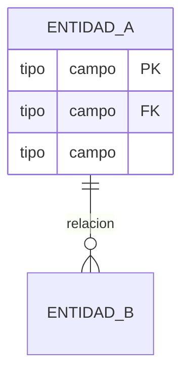

# Skill: Modelado de Base de Datos

## Cuándo usar este skill
- Diseñar o modificar el modelo de base de datos
- Generar diagramas ER
- Definir constraints e índices
- Planificar migraciones

## Referencia Base

Siempre partir del modelo existente en `docs/database-model.md`

## Entidades del Sistema

| Entidad | Descripción | RF relacionados |
|---------|-------------|-----------------|
| `FACULTAD` | Unidad organizacional | RF-01 |
| `USUARIO` | Docente o Secretaria | RF-01, RF-02, RF-03 |
| `SALA` | Sala de reuniones | RF-05 a RF-09 |
| `RECURSO_TECNOLOGICO` | Proyector, etc. | RF-08, RF-09 |
| `SALA_RECURSO` | Relación N:M sala-recurso | RF-08, RF-09 |
| `RESERVA` | Reserva de sala | RF-10 a RF-13 |
| `LOG_AUDITORIA` | Registro de acciones | RF-16 |

## Reglas de Integridad (Mapeadas a Restricciones)

```
R-02 → CHECK (hora_inicio >= '07:00' AND hora_fin <= '21:30')
R-03 → UNIQUE constraint compuesto o validación en servicio para no-solapamiento
R-05 → Reserva.estado solo transiciona CONFIRMADA → CANCELADA
R-06 → No DELETE en tabla RESERVA, solo UPDATE estado
R-08 → Usuario.rol DEFAULT 'DOCENTE'
R-11 → Trigger o middleware para LOG_AUDITORIA
```

## Formato de Diagrama ER

Usar siempre Mermaid `erDiagram`:



## Checklist de Validación del Modelo

- [ ] Todas las entidades tienen PK definida
- [ ] Las FK referencian entidades existentes
- [ ] Los campos `NOT NULL` están identificados
- [ ] Los `UNIQUE` constraints están definidos
- [ ] Los `CHECK` constraints mapean a restricciones del proyecto
- [ ] La tabla `LOG_AUDITORIA` cubre todas las acciones
- [ ] `RESERVA` no tiene operación DELETE
- [ ] Los roles son ENUM: solo DOCENTE y SECRETARIA
- [ ] Cada sala pertenece a exactamente una facultad
- [ ] Cada usuario pertenece a exactamente una facultad

## Nomenclatura

| Elemento | Convención | Ejemplo |
|----------|------------|---------|
| Tablas | UPPER_SNAKE_CASE | `SALA_RECURSO` |
| Columnas | snake_case | `correo_institucional` |
| PK | `id` | `USUARIO.id` |
| FK | `entidad_id` | `RESERVA.sala_id` |
| Timestamps | `fecha_*` | `fecha_creacion` |
| Booleanos | adjetivo | `habilitada`, `activo` |
