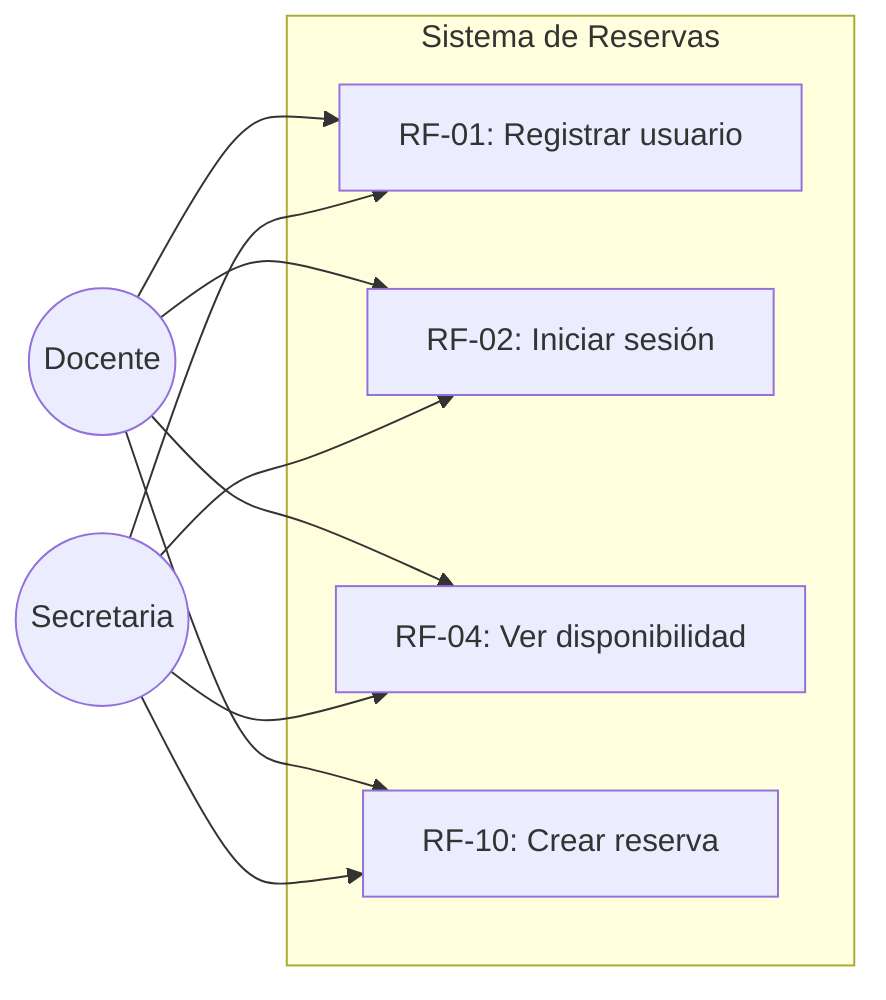
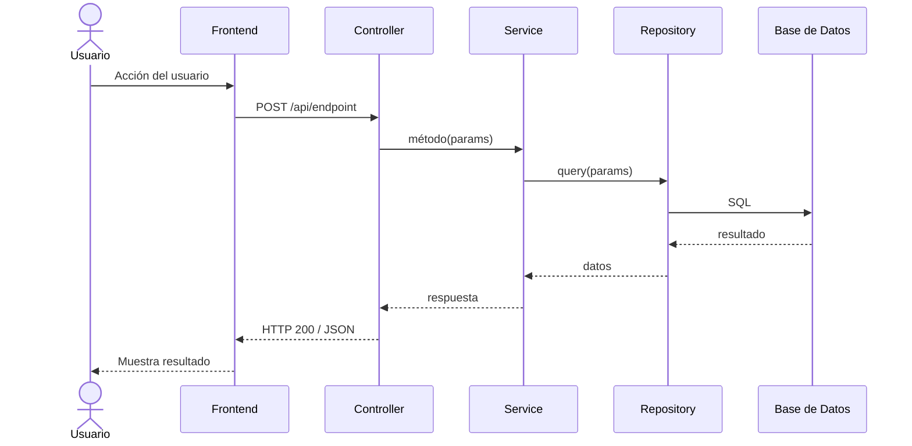
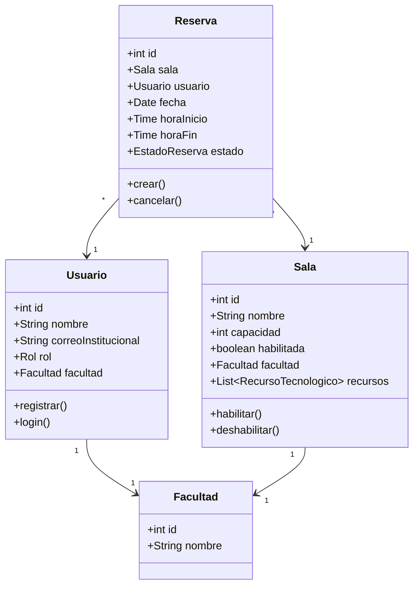

# Skill: Diagramas UML

## Cuándo usar este skill
- Generar diagramas de casos de uso del sistema
- Crear diagramas de secuencia para flujos específicos
- Diseñar diagramas de clases para la arquitectura

## Herramienta: Mermaid

Todos los diagramas deben generarse en **sintaxis Mermaid** para renderizado directo en markdown.

---

## 1. Diagramas de Casos de Uso

### Plantilla Base

### Reglas
- Cada caso de uso debe mapearse a un RF
- Incluir relaciones `<<include>>` y `<<extend>>` cuando aplique
- Agrupar por subsistema/épica
- Actores: solo **Docente** y **Secretaria** (no existe admin)

### Template por Épica

Para cada épica, el diagrama debe mostrar:
1. Actores que participan
2. Casos de uso correspondientes a los RF
3. Relaciones entre casos de uso (include/extend)
4. Límite del sistema

---

## 2. Diagramas de Secuencia

### Plantilla Base

### Diagramas de Secuencia Requeridos

| Flujo | RF | Participantes clave |
|-------|-----|-------------------|
| Registro de usuario | RF-01, RF-03 | Usuario, Auth Service, Whitelist |
| Login | RF-02 | Usuario, Auth Service, JWT |
| Crear reserva | RF-10, RF-11 | Usuario, Reservation Service, Conflict Validator |
| Cancelar reserva | RF-12 | Usuario, Reservation Service, Audit Logger |
| Ajustar reserva (secretaria) | RF-13 | Secretaria, Reservation Service, Audit Logger |
| Generar reporte | RF-17-20 | Secretaria, Report Service, Repository |

### Reglas para Secuencia
- Incluir **validaciones de negocio** (conflicto de horario, franja horaria)
- Mostrar **flujos alternativos** (error, conflicto encontrado)
- Incluir **auditoría** cuando aplique (R-11)
- Seguir la arquitectura en capas: Frontend → Controller → Service → Repository → DB

---

## 3. Diagramas de Clases

### Plantilla de Entidades

### Reglas para Clases
- Incluir **atributos** y **métodos** relevantes
- Mostrar **relaciones** con multiplicidad
- Separar por capas si es diagrama de arquitectura
- Mapear a las entidades del modelo de BD (`docs/database-model.md`)
