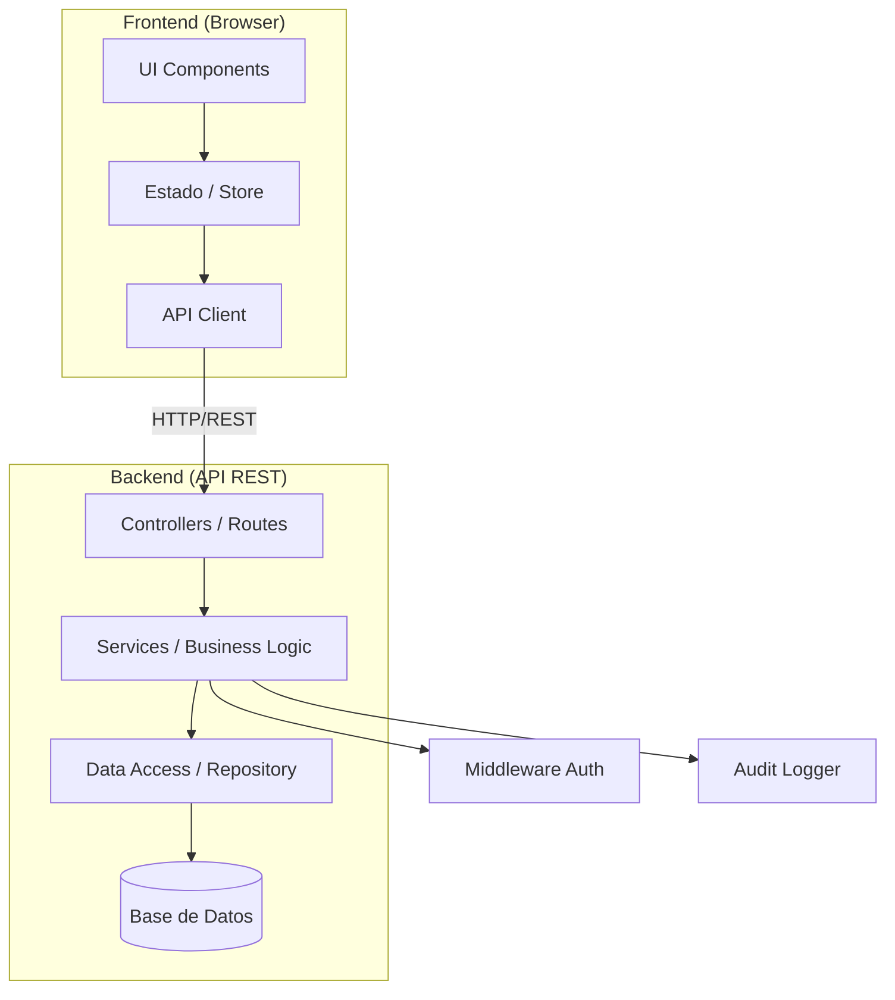

# Decisiones Arquitectónicas — Reservas de Salas

## Estilo Arquitectónico

**Arquitectura en Capas (N-Tier)** con separación cliente-servidor:



### Justificación

| RNF | Cómo la arquitectura lo cumple |
|-----|-------------------------------|
| RNF-01 Rendimiento | Separación de capas permite optimizar cada nivel independientemente |
| RNF-02 Escalabilidad | Backend stateless permite escalar horizontalmente |
| RNF-03 Disponibilidad | SPA accesible desde cualquier navegador |
| RNF-04 Mantenibilidad | Capas bien definidas facilitan modificaciones |
| RNF-05 Seguridad | Middleware de autenticación centralizado + RBAC |
| RNF-06 Integridad | Validaciones en capa de servicio + constraints en BD |

## Patrones de Diseño

| Patrón | Uso en el sistema |
|--------|-------------------|
| **Repository** | Abstracción de acceso a datos (capa F) |
| **Service Layer** | Lógica de negocio encapsulada (validación de conflictos, reglas de reserva) |
| **Middleware** | Autenticación, autorización por rol, logging de auditoría |
| **Observer** | Registro automático de trazabilidad (LOG_AUDITORIA) en cada acción |
| **Strategy** | Generación de reportes con diferentes métricas (por reservas, por horas, por usuario) |

## Estructura de Componentes

```
├── frontend/
│   ├── pages/           # Vistas principales
│   │   ├── Login
│   │   ├── Register
│   │   ├── Dashboard
│   │   ├── Calendar     # Vista de disponibilidad (RF-04)
│   │   ├── Rooms        # CRUD de salas (RF-05 a RF-09)
│   │   ├── Reservations # Gestión de reservas (RF-10 a RF-13)
│   │   ├── History      # Historial (RF-14, RF-15)
│   │   └── Reports      # Reportes (RF-17 a RF-20)
│   ├── components/      # Componentes reutilizables
│   ├── services/        # Clientes API
│   └── utils/           # Helpers
│
├── backend/
│   ├── routes/          # Definición de endpoints REST
│   ├── controllers/     # Manejo de request/response
│   ├── services/        # Lógica de negocio
│   ├── repositories/    # Acceso a datos
│   ├── middleware/       # Auth, RBAC, Audit
│   ├── models/          # Entidades/esquemas
│   └── utils/           # Helpers
│
└── database/
    ├── migrations/      # Migraciones de esquema
    └── seeds/           # Datos iniciales (lista blanca, recursos)
```

## Endpoints REST Principales

| Método | Ruta | Descripción | Rol |
|--------|------|-------------|-----|
| POST | `/api/auth/register` | Registro con correo institucional | Público |
| POST | `/api/auth/login` | Inicio de sesión | Público |
| GET | `/api/rooms` | Listar salas de la facultad | Docente, Secretaria |
| POST | `/api/rooms` | Crear sala | Secretaria |
| PUT | `/api/rooms/:id` | Editar sala | Secretaria |
| PATCH | `/api/rooms/:id/status` | Habilitar/deshabilitar | Secretaria |
| POST | `/api/rooms/:id/resources` | Agregar recurso | Secretaria |
| DELETE | `/api/rooms/:id/resources/:rid` | Retirar recurso | Secretaria |
| GET | `/api/rooms/:id/availability` | Disponibilidad calendario | Docente, Secretaria |
| GET | `/api/reservations` | Listar reservas | Según rol |
| POST | `/api/reservations` | Crear reserva | Docente, Secretaria |
| PATCH | `/api/reservations/:id/cancel` | Cancelar reserva | Propietario, Secretaria |
| PATCH | `/api/reservations/:id` | Ajustar reserva | Secretaria |
| GET | `/api/reports/by-count` | Reporte por nº reservas | Secretaria |
| GET | `/api/reports/by-hours` | Reporte por horas | Secretaria |
| GET | `/api/reports/by-user` | Reporte por usuario | Secretaria |
