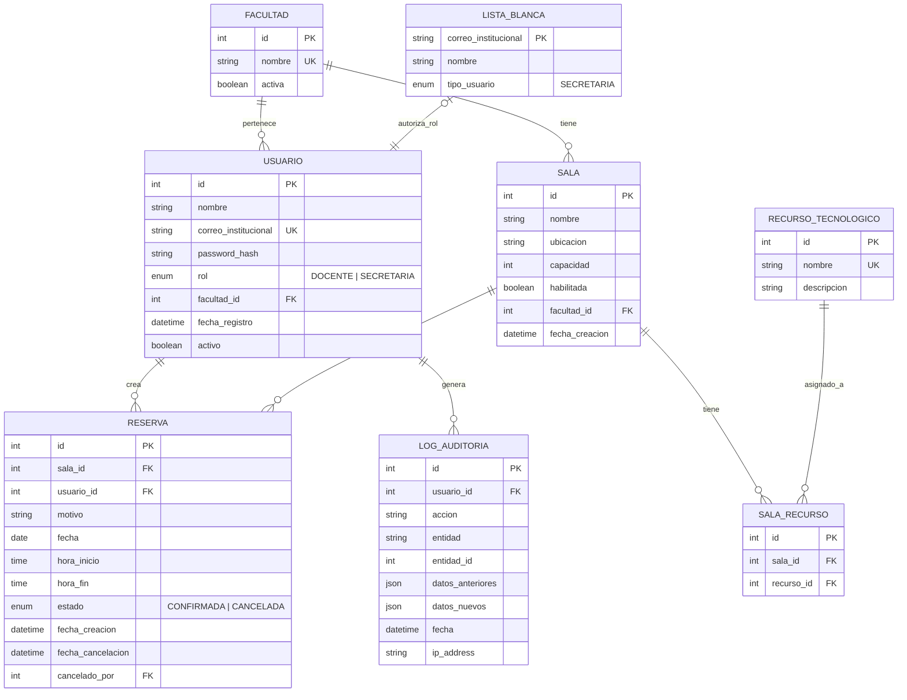

# Modelo Lógico de Base de Datos — Reservas de Salas

## Diagrama Entidad-Relación (Mermaid)



## Entidades Principales

### USUARIO
- Correo institucional como identificador único
- Rol asignado automáticamente: `DOCENTE` (default) o `SECRETARIA` (lista blanca)
- Vinculado a exactamente una `FACULTAD`

### SALA
- Pertenece a una `FACULTAD`
- Puede habilitarse/deshabilitarse (campo `habilitada`)
- Tiene recursos tecnológicos vía tabla intermedia `SALA_RECURSO`

### RESERVA
- **Nunca se elimina** — solo cambia estado a `CANCELADA`
- Validación: no puede existir otra reserva para la misma sala que se solape en `fecha` + `hora_inicio`/`hora_fin`
- Restricción: `hora_inicio >= 07:00` y `hora_fin <= 21:30`

### LISTA_BLANCA
- Contiene los correos institucionales autorizados para el rol `SECRETARIA` (RF-03, R-09)
- Relación **0..1 a 1** con `USUARIO`: un usuario puede o no estar en la lista blanca
- **Lógica de registro:** al registrarse, el sistema consulta `LISTA_BLANCA`; si el correo existe → rol `SECRETARIA`, si no → rol `DOCENTE`
- Por ahora solo contempla tipo `SECRETARIA`

### LOG_AUDITORIA
- Registra TODAS las acciones del sistema (R-11)
- Almacena datos anteriores y nuevos para trazabilidad completa

## Restricciones Clave de Integridad

```sql
-- No solapamiento de reservas (R-03, RF-11)
-- CHECK: No existe otra reserva CONFIRMADA para la misma sala
-- con fecha solapada en el rango [hora_inicio, hora_fin)

-- Franja horaria (R-02)
CHECK (hora_inicio >= '07:00' AND hora_fin <= '21:30')
CHECK (hora_inicio < hora_fin)

-- Estado de reserva (R-06)
-- Las reservas solo transicionan de CONFIRMADA → CANCELADA, nunca se DELETE
```
