# Documentación Técnica Completa — Sistema de Reservas de Salas UAO

> Arquitectura, diagramas, decisiones tecnológicas y flujos del sistema.

---

## 1. Diagramas C4

### 1.1 Nivel 1 — Contexto del Sistema

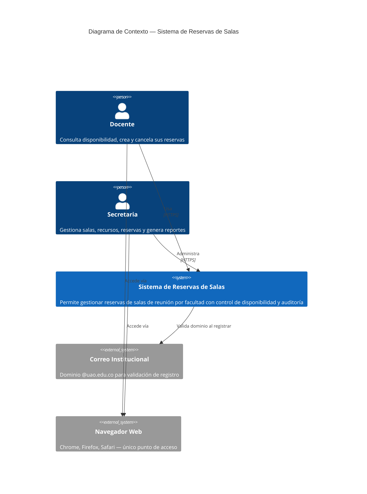

### 1.2 Nivel 2 — Contenedores

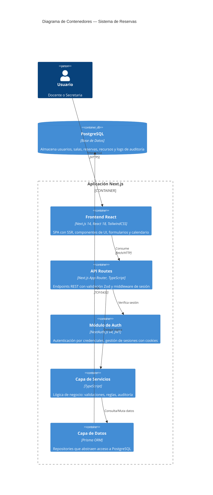

### 1.3 Nivel 3 — Componentes (Backend)

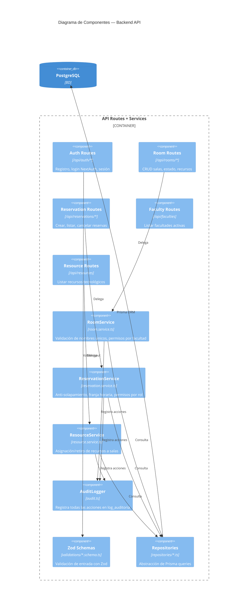

---

## 2. Diagrama de Arquitectura en Capas

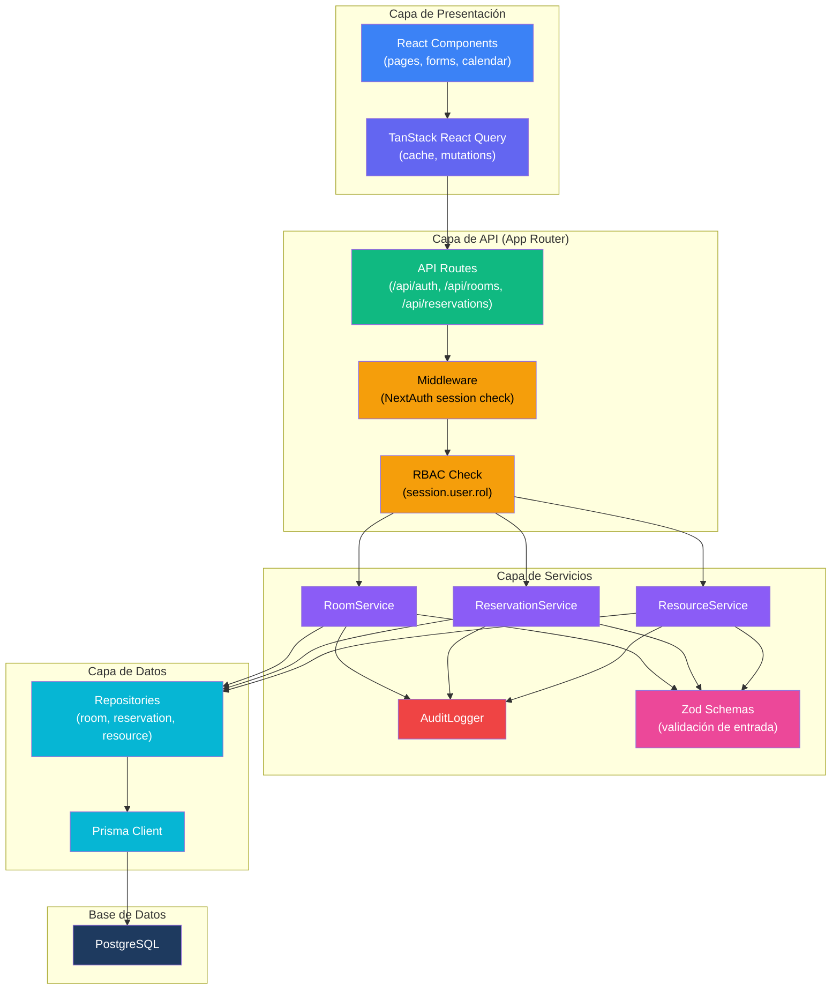

---

## 3. Diagramas de Secuencia

### 3.1 Registro de Usuario (RF-01, RF-03)

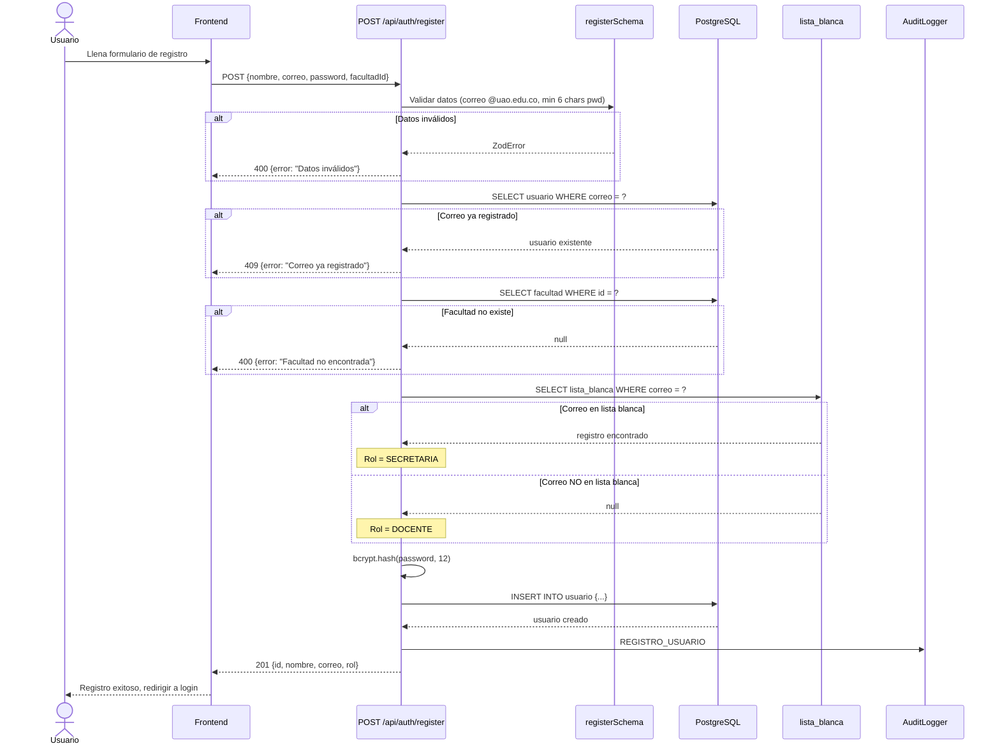

### 3.2 Login (RF-02)

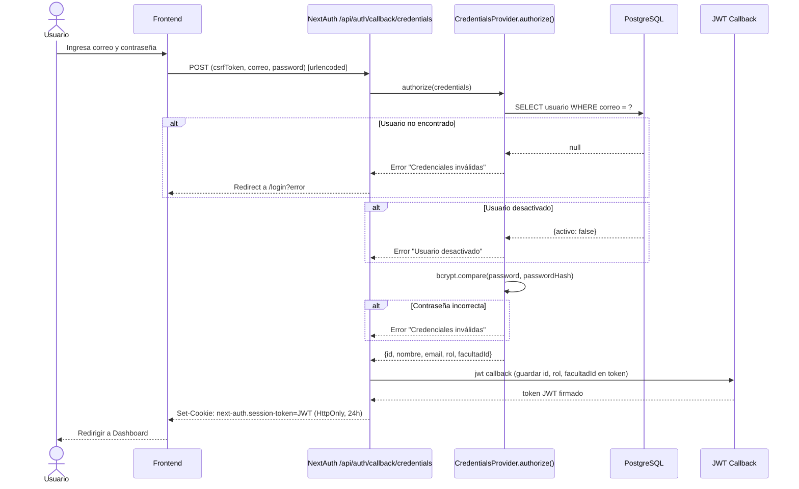

### 3.3 Crear Reserva (RF-10, RF-11, R-02, R-03)

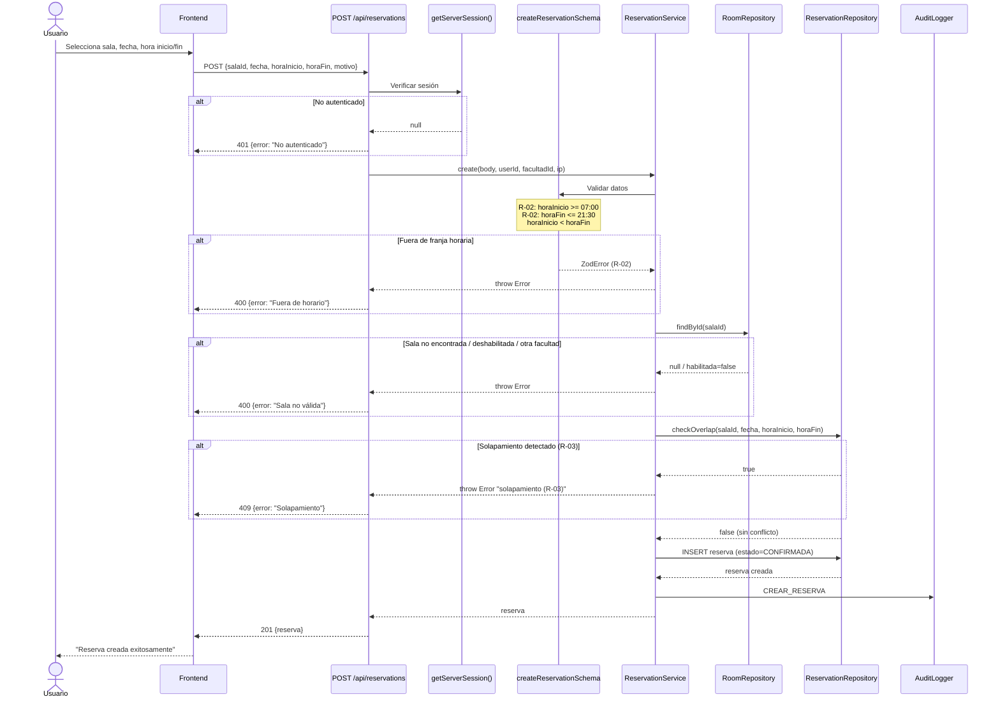

### 3.4 Cancelar Reserva (RF-12, R-06)

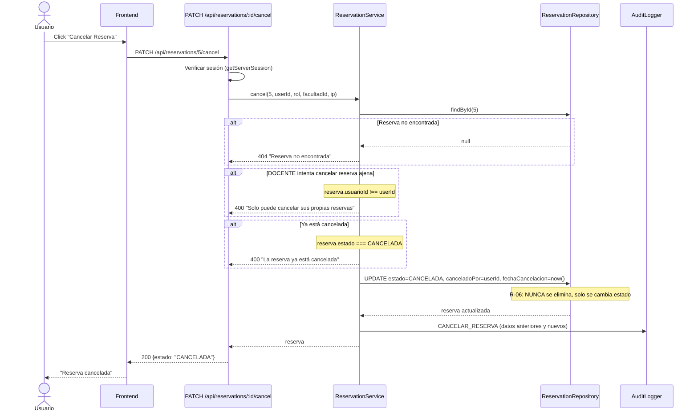

### 3.5 Crear Sala (RF-05, Secretaria)

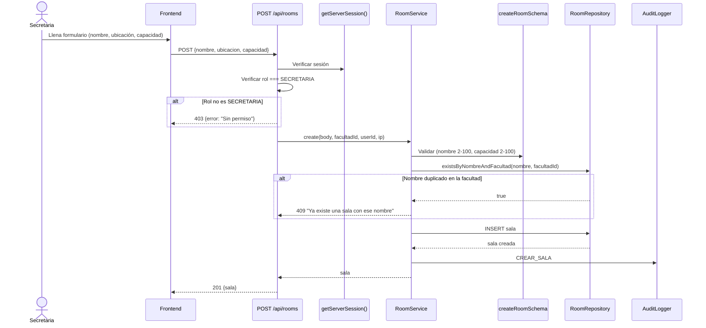

---

## 4. Diagrama Entidad-Relación

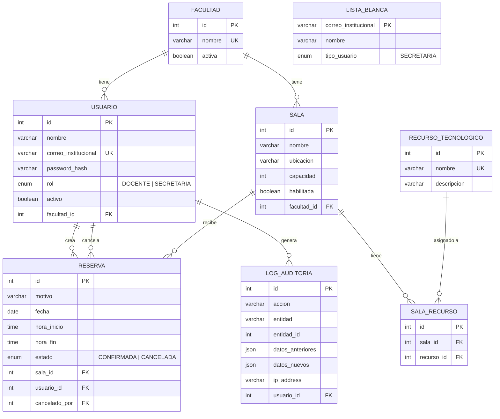

---

## 5. Decisiones Tecnológicas — El Porqué

### 5.1 Stack Principal

| Tecnología | Versión | ¿Por qué se eligió? |
|-----------|---------|-------------------| 
| **Next.js** | 14.2 | Framework fullstack que unifica frontend y backend en un solo proyecto. El App Router permite colocar las API Routes junto al frontend, eliminando la necesidad de un servidor backend separado. **Reduce la complejidad operativa** para un proyecto universitario. SSR mejora SEO y rendimiento inicial. |
| **React** | 18 | Estándar de la industria para interfaces interactivas. El modelo de componentes facilita construir el calendario de disponibilidad y los formularios CRUD. Amplio ecosistema de librerías compatibles. |
| **TypeScript** | 5 | Previene errores comunes en tiempo de desarrollo. Los tipos fuertes **garantizan consistencia** entre frontend, API y base de datos. Crucial para un sistema donde errores (doble reserva, permisos incorrectos) tienen impacto directo. |
| **PostgreSQL** | - | Base de datos relacional robusta, ideal para datos transaccionales con integridad referencial. Las reservas, usuarios y salas tienen **relaciones claras** que se modelan naturalmente en SQL. Soporte nativo de tipos `DATE`, `TIME` y `JSON` para auditoría. |

### 5.2 Autenticación y Seguridad

| Tecnología | ¿Por qué? |
|-----------|----------|
| **NextAuth.js v4** | Se integra nativamente con Next.js. El CredentialsProvider permite autenticación con correo/contraseña sin depender de OAuth externo (los usuarios tienen correo institucional @uao.edu.co, no Google/GitHub). **Simplifica la gestión de sesiones** con JWT almacenado en cookies HttpOnly. |
| **bcryptjs** | Estándar de la industria para hash de contraseñas. Factor de costo 12 provee **seguridad suficiente** sin afectar rendimiento. No almacena contraseñas en texto plano (cumple RNF-05). |
| **JWT (estrategia de sesión)** | Las sesiones JWT son **stateless**: el servidor no necesita almacenar sesiones en memoria ni en BD. Esto permite escalar horizontalmente sin sincronizar estado entre instancias (cumple RNF-02). Expiración de 24h como balance entre seguridad y comodidad. |
| **RBAC en capa de API** | Cada route verifica `session.user.rol` directamente. Sin middleware genérico para mantener **visibilidad explícita** de qué rol necesita cada endpoint. Previene errores de configuración en un sistema con solo 2 roles. |

### 5.3 Validación y Datos

| Tecnología | ¿Por qué? |
|-----------|----------|
| **Zod** | Validación en tiempo de ejecución con inferencia de tipos TypeScript. Los schemas definen **una única fuente de verdad** para la estructura de datos (se usa en frontend y backend). Mejor integración con TypeScript que Joi. Validaciones complejas (franja horaria R-02) se expresan como `refine()`. |
| **Prisma ORM** | Genera un cliente tipado desde el schema, lo que proporciona **autocompletado perfecto** y previene errores de SQL. Las migraciones versionadas aseguran que el esquema de BD sea reproducible. El patrón Repository se implementa naturalmente sobre Prisma. |

### 5.4 Frontend

| Tecnología | ¿Por qué? |
|-----------|----------|
| **TailwindCSS** | Estilos utilitarios que aceleran desarrollo de UI sin escribir CSS personalizado. **Consistencia visual** con la misma paleta de colores en todo el sistema. Elimina problemas de naming de clases CSS. |
| **TanStack React Query** | Gestiona cache de datos del servidor, **eliminando estados de carga manuales**. Las mutations invalidan el cache automáticamente, manteniendo la UI sincronizada sin lógica adicional. Perfecto para las listas de salas y reservas que se consultan frecuentemente. |
| **Lucide React** | Iconos SVG ligeros y consistentes. Reemplazo moderno de FontAwesome con **mejor tree-shaking** (solo se importan los íconos usados). |
| **Sonner** | Toasts/notificaciones elegantes con animaciones. Informan al usuario de acciones exitosas o errores sin modales intrusivos. |
| **date-fns** | Manipulación de fechas sin la pesadez de Moment.js. Funciones puras e immutables que **no mutan objetos Date**. Crucial para manejar correctamente las fechas de reservas y franjas horarias. |

### 5.5 Decisiones Arquitectónicas Clave

#### ¿Por qué arquitectura en capas (Routes → Services → Repositories)?

```
ALTERNATIVAS CONSIDERADAS:
├── Opción A: Todo en las API Routes (monolítico)
│   ❌ Código duplicado, difícil de testear, alta acoplamiento
│
├── Opción B: Microservicios
│   ❌ Excesivo para un proyecto universitario, complejidad operativa alta
│
└── Opción C: Capas bien separadas ✅
    ✅ Cada capa tiene una responsabilidad clara
    ✅ Los servicios son testeables sin HTTP
    ✅ Los repositories se pueden cambiar sin tocar lógica
    ✅ Complejidad adecuada para el equipo y proyecto
```

#### ¿Por qué reservas nunca se eliminan (R-06)?

- **Trazabilidad**: La tabla `log_auditoria` referencia `entidad_id` de reservas. Si se eliminan, los logs quedan huérfanos.
- **Auditoría**: Es requisito ver quién canceló, cuándo y por qué.
- **Integridad**: `DELETE` puede causar cascadas no deseadas. `CANCELADA` es un estado final seguro.
- **Reportes**: Los reportes (RF-17 a RF-20) necesitan datos históricos completos.

#### ¿Por qué auto-asignación de roles vía lista_blanca (R-07, R-08, R-09)?

- **Sin administrador**: El sistema es self-service. No hay persona que asigne roles manualmente.
- **Seguridad**: Solo correos pre-aprobados obtienen rol SECRETARIA.
- **Simplicidad**: Un solo endpoint de registro maneja ambos roles. La tabla `lista_blanca` se gestiona directamente en BD por el DBA.

#### ¿Por qué auditoría con patrón Observer?

```typescript
// Después de CADA operación que modifica datos:
await audit({
  accion: 'CREAR_RESERVA',
  entidad: 'RESERVA',
  datosAnteriores: null,
  datosNuevos: { ... },
});
```

- **R-11 obliga** a registrar todas las acciones.
- Se implementa como función llamada explícitamente (no middleware) para tener **control total** de qué datos guardar antes/después.
- `try/catch` interno: la auditoría **nunca bloquea** la operación principal.

---

## 6. Diagrama de Flujo de Autorización (RBAC)

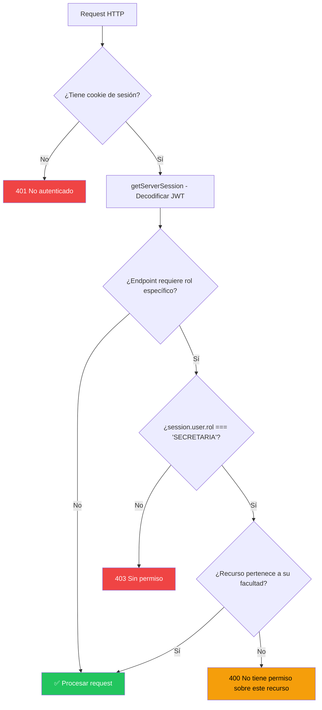

---

## 7. Mapa de Endpoints con Trazabilidad

| Endpoint | Método | Rol | RF | R | Servicio | Auditoría |
|----------|--------|-----|-----|---|----------|-----------|
| `/api/auth/register` | POST | Público | RF-01, RF-03 | R-08, R-09 | directo | REGISTRO_USUARIO |
| `/api/auth/[...nextauth]` | GET/POST | Público | RF-02 | — | NextAuth | — |
| `/api/faculties` | GET | Público | — | — | Prisma directo | — |
| `/api/rooms` | GET | Auth | RF-04 | — | roomService.listByFacultad | — |
| `/api/rooms` | POST | Secretaria | RF-05 | — | roomService.create | CREAR_SALA |
| `/api/rooms/:id` | GET | Auth | — | — | roomService.getById | — |
| `/api/rooms/:id` | PUT | Secretaria | RF-06 | — | roomService.update | EDITAR_SALA |
| `/api/rooms/:id/status` | PATCH | Secretaria | RF-07 | — | roomService.updateStatus | CAMBIAR_ESTADO_SALA |
| `/api/rooms/:id/resources` | GET | Auth | RF-08 | — | resourceService.listBySala | — |
| `/api/rooms/:id/resources` | POST | Secretaria | RF-08 | — | resourceService.addToSala | AGREGAR_RECURSO |
| `/api/rooms/:id/resources/:rid` | DELETE | Secretaria | RF-09 | — | resourceService.removeFromSala | RETIRAR_RECURSO |
| `/api/resources` | GET | Auth | — | — | resourceService.listAll | — |
| `/api/reservations` | GET | Auth | RF-14, RF-15 | — | reservationService.list | — |
| `/api/reservations` | POST | Auth | RF-10, RF-11 | R-02, R-03 | reservationService.create | CREAR_RESERVA |
| `/api/reservations/:id/cancel` | PATCH | Auth | RF-12 | R-06 | reservationService.cancel | CANCELAR_RESERVA |
