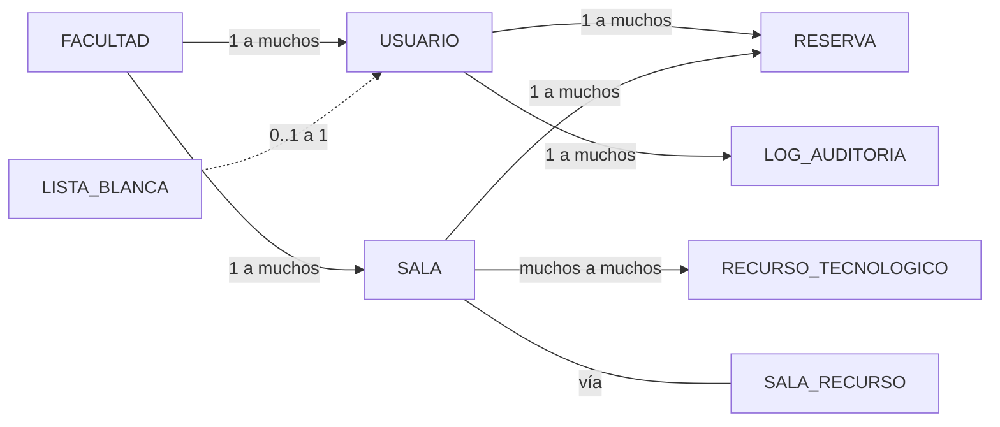

# Modelado Funcional de Datos — Reservas de Salas

> **Asignatura:** Ingeniería de Software 1  
> **Facultad:** Ingeniería y Ciencias Básicas — Programa de Ingeniería Informática  
> **Creado:** Marzo 5, 2026

---

## 1. Propósito del Documento

Este documento explica **por qué** existe cada entidad y cada atributo en el modelo de base de datos. Es un complemento funcional al diagrama ER técnico (`database-model.md`), orientado a entender las decisiones de diseño desde la perspectiva del negocio.

---

## 2. Diccionario de Entidades

### 2.1 FACULTAD

> **¿Por qué existe?** Las salas de reuniones pertenecen a una facultad específica. Los usuarios solo ven y reservan salas de su propia facultad. Es la unidad organizativa que segmenta todo el sistema.

| Atributo | Tipo | Restricción | ¿Por qué? |
|----------|------|-------------|------------|
| `id` | int | PK, auto-increment | Identificador interno eficiente para JOINs y FKs |
| `nombre` | string | UNIQUE, NOT NULL | Nombre visible de la facultad (ej. "Ingeniería y Ciencias Básicas"). Único para evitar duplicados |
| `activa` | boolean | DEFAULT true | Permite deshabilitar una facultad sin eliminarla, preservando datos históricos |

**Reglas de negocio asociadas:**
- Una facultad tiene múltiples salas y múltiples usuarios
- Los reportes (RF-17 a RF-20) se generan por facultad
- Un usuario solo pertenece a **una** facultad

---

### 2.2 USUARIO

> **¿Por qué existe?** Representa a las personas que interactúan con el sistema: docentes que reservan salas y secretarias que las gestionan. El registro usa correo institucional para garantizar que solo miembros de la universidad accedan.

| Atributo | Tipo | Restricción | ¿Por qué? |
|----------|------|-------------|------------|
| `id` | int | PK, auto-increment | Clave surrogate para rendimiento. El correo es UNIQUE pero no PK para optimizar índices y FKs |
| `nombre` | string | NOT NULL | Nombre completo del usuario para mostrar en interfaces y reportes |
| `correo_institucional` | string | UNIQUE, NOT NULL | Identificador de negocio. Valida que el usuario pertenece a la universidad. Se usa para consultar la lista blanca al registrarse (RF-03) |
| `password_hash` | string(255) | NOT NULL | Hash bcrypt de la contraseña. Se almacena el hash, **nunca** la contraseña en texto plano (RNF-05). Mínimo 255 chars para bcrypt |
| `rol` | enum | `DOCENTE` \| `SECRETARIA` | Determina los permisos del usuario. Asignado automáticamente al registrarse consultando `LISTA_BLANCA` (RF-03, R-07, R-08, R-09) |
| `facultad_id` | int | FK → FACULTAD(id), NOT NULL | Vincula al usuario con su facultad. Determina qué salas puede ver y reservar |
| `fecha_registro` | datetime | DEFAULT NOW() | Registro de cuándo se creó la cuenta. Útil para auditoría y reportes |
| `activo` | boolean | DEFAULT true | Soft-delete: deshabilitar cuenta sin perder historial de reservas |

**Reglas de negocio asociadas:**
- RF-01: Registro obligatorio con correo institucional
- RF-02: Login con correo + contraseña
- RF-03: Rol asignado automáticamente (docente por defecto, secretaria si está en lista blanca)
- R-07: No existe rol administrador
- Un usuario crea múltiples reservas y genera múltiples registros de auditoría

---

### 2.3 LISTA_BLANCA

> **¿Por qué existe?** El sistema necesita un mecanismo para distinguir secretarias de docentes **sin** intervención de un administrador (R-07). Esta tabla contiene los correos pre-autorizados. Al registrarse, si el correo aparece aquí, el rol asignado es `SECRETARIA`; si no, es `DOCENTE`.

| Atributo | Tipo | Restricción | ¿Por qué? |
|----------|------|-------------|------------|
| `correo_institucional` | string | PK | El correo es tanto identificador como mecanismo de búsqueda. Al registrarse, se hace un `SELECT` por este campo |
| `nombre` | string | NOT NULL | Nombre de referencia de la persona autorizada, para identificación visual al gestionar la lista |
| `tipo_usuario` | enum | `SECRETARIA` | Por ahora solo secretarias están en lista blanca. El enum permite extender a futuro sin cambio de esquema |

**Reglas de negocio asociadas:**
- RF-03: Asignación automática de rol
- R-09: Rol secretaria solo por lista blanca de correos
- Relación **0..1 a 1** con `USUARIO`: no todo usuario aparece en la lista, pero si aparece, su rol cambia

**Flujo funcional:**
```
Registro de usuario
    └─→ Consulta: ¿correo_institucional ∈ LISTA_BLANCA?
        ├─→ SÍ → rol = SECRETARIA
        └─→ NO → rol = DOCENTE (default)
```

---

### 2.4 SALA

> **¿Por qué existe?** Representa una sala de reuniones física dentro de una facultad. Es el recurso principal que los usuarios reservan. Solo se usan para reuniones, **no para clases** (R-01).

| Atributo | Tipo | Restricción | ¿Por qué? |
|----------|------|-------------|------------|
| `id` | int | PK, auto-increment | Identificador único de la sala |
| `nombre` | string | NOT NULL | Nombre descriptivo (ej. "Sala de Consejo 201") para que los usuarios identifiquen la sala |
| `ubicacion` | string | — | Ubicación física (edificio, piso). Complemento informativo para que el usuario sepa dónde ir |
| `capacidad` | int | CHECK ≥ 1 | Número máximo de personas. Útil para que el usuario elija sala adecuada según asistentes |
| `habilitada` | boolean | DEFAULT true | Permite deshabilitar sala temporalmente (ej. mantenimiento) sin eliminar datos (RF-07) |
| `facultad_id` | int | FK → FACULTAD(id), NOT NULL | Vínculo con la facultad dueña de la sala. Asegura que los usuarios solo vean salas de su facultad |
| `fecha_creacion` | datetime | DEFAULT NOW() | Registro de creación para auditoría |

**Reglas de negocio asociadas:**
- RF-05: Solo secretarias crean salas (asociadas a su propia facultad)
- RF-06: Solo secretarias editan salas
- RF-07: La secretaria puede habilitar/deshabilitar una sala
- R-01: Salas de reuniones, no de clases
- Una sala puede tener múltiples reservas y múltiples recursos tecnológicos

---

### 2.5 RECURSO_TECNOLOGICO

> **¿Por qué existe?** Es un catálogo de equipos tecnológicos disponibles (proyectores, pantallas, sistemas de videoconferencia, etc.). Permite a los usuarios saber qué equipamiento tiene cada sala antes de reservar.

| Atributo | Tipo | Restricción | ¿Por qué? |
|----------|------|-------------|------------|
| `id` | int | PK, auto-increment | Identificador del tipo de recurso |
| `nombre` | string | UNIQUE, NOT NULL | Nombre del recurso (ej. "Proyector", "Pantalla LED"). Único para evitar duplicados en el catálogo |
| `descripcion` | string | — | Detalle adicional (ej. "Proyector Epson 4K, HDMI + VGA") |

**Reglas de negocio asociadas:**
- RF-08: Secretaria asigna recursos a una sala
- RF-09: Secretaria retira recursos de una sala
- Es un **catálogo reutilizable**: el mismo tipo de recurso se puede asignar a múltiples salas

---

### 2.6 SALA_RECURSO (tabla puente)

> **¿Por qué existe?** Una sala puede tener múltiples recursos, y un mismo tipo de recurso puede estar en múltiples salas. Esta relación **muchos a muchos** requiere una tabla intermedia.

| Atributo | Tipo | Restricción | ¿Por qué? |
|----------|------|-------------|------------|
| `id` | int | PK, auto-increment | Identificador de la asignación |
| `sala_id` | int | FK → SALA(id), NOT NULL | Referencia a la sala que tiene el recurso |
| `recurso_id` | int | FK → RECURSO_TECNOLOGICO(id), NOT NULL | Referencia al recurso asignado |

**Restricción compuesta:** `UNIQUE(sala_id, recurso_id)` — evita asignar el mismo recurso dos veces a la misma sala.

---

### 2.7 RESERVA

> **¿Por qué existe?** Es la entidad central del sistema. Registra que un usuario ha apartado una sala en una fecha y franja horaria específica. **Nunca se elimina** (R-06): solo cambia de estado `CONFIRMADA` → `CANCELADA`, preservando el historial completo.

| Atributo | Tipo | Restricción | ¿Por qué? |
|----------|------|-------------|------------|
| `id` | int | PK, auto-increment | Identificador de la reserva |
| `sala_id` | int | FK → SALA(id), NOT NULL | Sala reservada. Vinculada para validar conflictos de horario |
| `usuario_id` | int | FK → USUARIO(id), NOT NULL | Quién creó la reserva. Necesario para historial personal (RF-14) y reportes por usuario (RF-19) |
| `motivo` | string | — | Descripción del propósito de la reunión (ej. "Consejo de Facultad", "Comité Curricular") |
| `fecha` | date | NOT NULL | Día de la reserva. Se combina con `hora_inicio` / `hora_fin` para validar solapamiento |
| `hora_inicio` | time | CHECK ≥ 07:00 | Inicio de la franja reservada. Mínimo 7:00 AM según reglas del negocio (R-02) |
| `hora_fin` | time | CHECK ≤ 21:30 | Fin de la franja reservada. Máximo 9:30 PM según reglas del negocio (R-02) |
| `estado` | enum | `CONFIRMADA` \| `CANCELADA` | Estado de la reserva. Solo transiciona en una dirección: CONFIRMADA → CANCELADA |
| `fecha_creacion` | datetime | DEFAULT NOW() | Cuándo se creó la reserva. No se modifica |
| `fecha_cancelacion` | datetime | NULL por default | Se llena solo al cancelar. Permite saber cuándo se liberó la sala |
| `cancelado_por` | int | FK → USUARIO(id), NULL | Quién canceló la reserva. Puede ser el docente dueño o la secretaria (RF-12, RF-13) |

**Reglas de negocio asociadas:**
- RF-10: Crear reserva respetando disponibilidad
- RF-11: Validación automática anti-solapamiento
- RF-12: Cancelar reserva (docente cancela la propia)
- RF-13: Ajustar reserva (solo secretaria)
- R-02: Solo entre 7:00 AM y 9:30 PM
- R-03: No reservas simultáneas en la misma sala
- R-06: Nunca se eliminan, solo se cancelan

**Validación de conflictos (RF-11, R-03):**
```sql
-- No debe existir otra reserva CONFIRMADA para la misma sala
-- en la misma fecha con horarios solapados
NOT EXISTS (
    SELECT 1 FROM RESERVA
    WHERE sala_id = @sala_id
      AND fecha = @fecha
      AND estado = 'CONFIRMADA'
      AND hora_inicio < @hora_fin
      AND hora_fin > @hora_inicio
)
```

---

### 2.8 LOG_AUDITORIA

> **¿Por qué existe?** El requisito R-11 exige que **todas las acciones** queden registradas para auditoría. Esta tabla es inmutable (solo INSERT, nunca UPDATE ni DELETE) y almacena un snapshot de los datos antes y después de cada operación.

| Atributo | Tipo | Restricción | ¿Por qué? |
|----------|------|-------------|------------|
| `id` | int | PK, auto-increment | Identificador del evento de auditoría |
| `usuario_id` | int | FK → USUARIO(id), NOT NULL | Quién realizó la acción. Esencial para trazabilidad (RF-16) |
| `accion` | string | NOT NULL | Operación realizada (ej. "CREAR_RESERVA", "CANCELAR_RESERVA", "EDITAR_SALA", "REGISTRO_USUARIO") |
| `entidad` | string | NOT NULL | Tabla afectada (ej. "RESERVA", "SALA", "USUARIO"). Permite filtrar por tipo de entidad |
| `entidad_id` | int | NOT NULL | ID del registro afectado. Junto con `entidad` identifica exactamente qué registro cambió |
| `datos_anteriores` | json | NULL | Snapshot JSON del estado **antes** del cambio. NULL en operaciones de creación |
| `datos_nuevos` | json | NULL | Snapshot JSON del estado **después** del cambio. NULL en operaciones de eliminación lógica |
| `fecha` | datetime | DEFAULT NOW() | Timestamp exacto de la acción |
| `ip_address` | string | — | Dirección IP desde donde se realizó la acción. Capa extra de seguridad |

**Reglas de negocio asociadas:**
- RF-16: Registro de trazabilidad
- R-11: Trazabilidad obligatoria en todas las acciones
- Es una tabla de **solo escritura** (append-only). Nunca se modifica ni se elimina ningún registro

**Ejemplo de registro:**
```json
{
  "id": 42,
  "usuario_id": 5,
  "accion": "CANCELAR_RESERVA",
  "entidad": "RESERVA",
  "entidad_id": 18,
  "datos_anteriores": { "estado": "CONFIRMADA" },
  "datos_nuevos": { "estado": "CANCELADA", "fecha_cancelacion": "2026-03-05T14:30:00", "cancelado_por": 5 },
  "fecha": "2026-03-05T14:30:00",
  "ip_address": "192.168.1.45"
}
```

---

## 3. Mapa de Relaciones



| Relación | Cardinalidad | Significado |
|----------|-------------|-------------|
| FACULTAD → USUARIO | 1 : N | Una facultad tiene muchos usuarios; un usuario pertenece a una sola facultad |
| FACULTAD → SALA | 1 : N | Una facultad tiene muchas salas; una sala pertenece a una sola facultad |
| LISTA_BLANCA → USUARIO | 0..1 : 1 | Un usuario puede o no estar en lista blanca; determina su rol |
| USUARIO → RESERVA | 1 : N | Un usuario crea muchas reservas; cada reserva tiene un único creador |
| SALA → RESERVA | 1 : N | Una sala recibe muchas reservas; cada reserva es para una sola sala |
| SALA ↔ RECURSO_TECNOLOGICO | N : M | Muchas salas pueden tener muchos recursos (vía SALA_RECURSO) |
| USUARIO → LOG_AUDITORIA | 1 : N | Un usuario genera muchos registros de auditoría |

---

## 4. Matriz de Trazabilidad: Entidades → Requisitos

| Entidad | Requisitos Funcionales | Restricciones |
|---------|----------------------|---------------|
| **FACULTAD** | RF-01, RF-04, RF-05, RF-15 | — |
| **USUARIO** | RF-01, RF-02, RF-03, RF-14, RF-19 | R-07, R-08, R-09 |
| **LISTA_BLANCA** | RF-03 | R-07, R-09 |
| **SALA** | RF-04, RF-05, RF-06, RF-07 | R-01 |
| **RECURSO_TECNOLOGICO** | RF-08, RF-09 | — |
| **SALA_RECURSO** | RF-08, RF-09 | — |
| **RESERVA** | RF-10, RF-11, RF-12, RF-13, RF-14, RF-15, RF-17, RF-18 | R-02, R-03, R-04, R-05, R-06 |
| **LOG_AUDITORIA** | RF-16 | R-11 |
