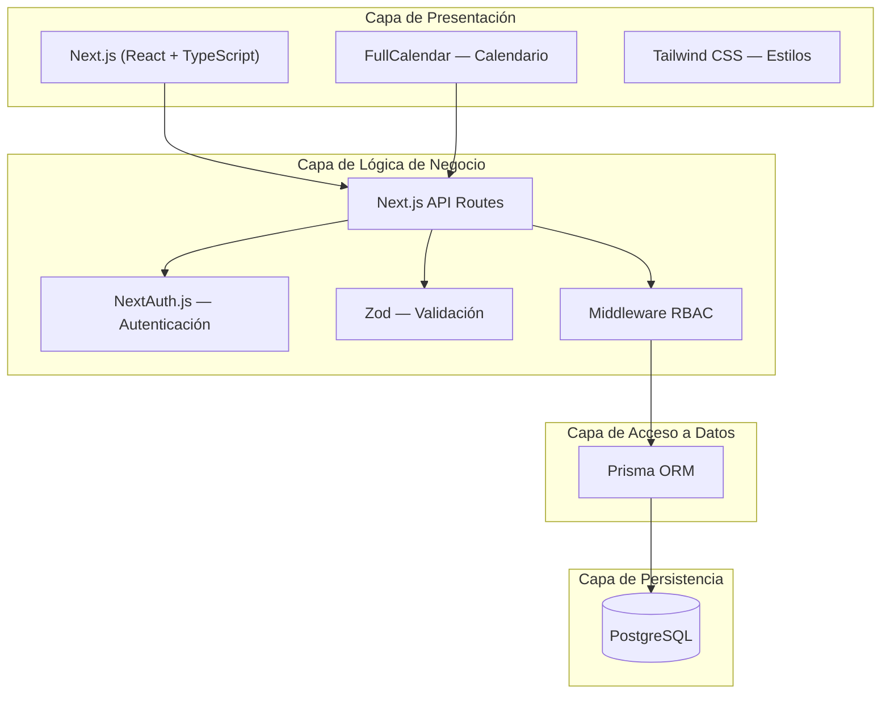

# Selección de Stack Tecnológico — Sistema de Reservas de Salas de Reuniones

> **Asignatura:** Ingeniería de Software 1  
> **Facultad:** Ingeniería y Ciencias Básicas — Programa de Ingeniería Informática  
> **Creado:** Marzo 5, 2026

---

## 1. Resumen Ejecutivo

Se adopta un stack **full-stack JavaScript/TypeScript** basado en **Next.js** para el desarrollo del Sistema Web de Reservas de Salas de Reuniones. Esta decisión se fundamenta en la naturaleza del sistema (aplicación web CRUD con autenticación, calendario y reportes), el cronograma académico del proyecto y la necesidad de mantener un solo lenguaje a lo largo de todas las capas de la aplicación.

---

## 2. Stack Tecnológico Seleccionado

### 2.1 Tabla Resumen

| Capa | Tecnología | Versión | Propósito |
|------|-----------|---------|-----------|
| **Lenguaje** | TypeScript | 5.x | Tipado estático en frontend y backend |
| **Framework Full-Stack** | Next.js (App Router) | 14+ | Renderizado, routing, API Routes |
| **Runtime** | Node.js | 20 LTS | Entorno de ejecución del servidor |
| **ORM** | Prisma | 5.x | Modelado de datos y migraciones |
| **Base de Datos** | PostgreSQL | 16 | Persistencia relacional |
| **Autenticación** | NextAuth.js (Auth.js) | 5.x | Sesiones, login con credenciales |
| **Validación** | Zod | 3.x | Validación de esquemas en cliente y servidor |
| **Calendario UI** | FullCalendar (React) | 6.x | Visualización de disponibilidad (RF-04) |
| **Estilos** | Tailwind CSS | 3.x | Sistema de diseño utilitario |
| **Pruebas** | Jest + React Testing Library | — | Pruebas unitarias e integración |
| **Control de Versiones** | Git + GitHub | — | Versionamiento y colaboración |
| **Despliegue** | Vercel | — | Hosting y CI/CD integrado |

---

### 2.2 Diagrama de Arquitectura por Capas



---

## 3. Justificación de Cada Tecnología

### 3.1 Next.js como Framework Full-Stack

| Criterio | Justificación |
|----------|---------------|
| **Unificación** | Permite desarrollar frontend y backend en un solo proyecto con un solo lenguaje (TypeScript), eliminando la necesidad de mantener dos repositorios separados |
| **API Routes** | Los endpoints REST (`/api/auth/*`, `/api/rooms/*`, `/api/reservations/*`) se implementan directamente dentro del proyecto sin necesidad de un servidor externo |
| **Rendimiento (RNF-01)** | Server-Side Rendering (SSR) y React Server Components reducen el tiempo de carga inicial |
| **Mantenibilidad (RNF-04)** | Estructura de proyecto estandarizada con convenciones claras de Next.js (App Router) |
| **Ecosistema** | Amplia comunidad, documentación oficial extensa y compatibilidad con Vercel para despliegue |

### 3.2 TypeScript

| Criterio | Justificación |
|----------|---------------|
| **Seguridad de tipos** | Detecta errores en tiempo de compilación antes de llegar a producción |
| **Integridad de datos (RNF-06)** | Tipos compartidos entre frontend y backend garantizan consistencia en los contratos de datos |
| **Productividad** | Autocompletado y refactorización inteligente en el IDE |
| **Documentación implícita** | Las interfaces y tipos sirven como documentación viva del sistema |

### 3.3 Prisma ORM + PostgreSQL

| Criterio | Justificación |
|----------|---------------|
| **Modelado declarativo** | El esquema de Prisma define las entidades (Usuario, Sala, Reserva, Facultad, Recurso, Log_Auditoria) de forma clara y versionable |
| **Migraciones automáticas** | Control de cambios en el esquema de base de datos con historial completo |
| **Integridad (RNF-06)** | PostgreSQL soporta constraints (UNIQUE, CHECK, FK), transacciones ACID y validación a nivel de base de datos |
| **Consultas tipadas** | Prisma Client genera tipos TypeScript automáticamente a partir del esquema, evitando errores en queries |
| **Escalabilidad (RNF-02)** | PostgreSQL maneja eficientemente el volumen de datos esperado por el sistema |

### 3.4 NextAuth.js (Auth.js)

| Criterio | Justificación |
|----------|---------------|
| **RF-01 / RF-02** | Soporta registro e inicio de sesión con credenciales (correo + contraseña) |
| **RF-03** | Permite implementar la lógica de asignación automática de roles (docente/secretaria por lista blanca) |
| **Seguridad (RNF-05)** | Manejo seguro de sesiones con JWT o cookies httpOnly, CSRF protection integrada |
| **Integración nativa** | Se integra directamente con Next.js sin configuración adicional de servidor |

### 3.5 Zod (Validación)

| Criterio | Justificación |
|----------|---------------|
| **Validación dual** | El mismo esquema valida datos en el formulario del cliente y en el endpoint del servidor |
| **Reglas de negocio** | Implementa validaciones como franja horaria 7:00 AM – 9:30 PM (R-02), capacidad entre 2 y 100, formato de correo institucional |
| **Type inference** | Genera tipos TypeScript automáticamente a partir de los esquemas de validación |

### 3.6 FullCalendar (React)

| Criterio | Justificación |
|----------|---------------|
| **RF-04** | Componente de calendario visual maduro con vistas diaria, semanal y mensual |
| **Interactividad** | Soporte para drag & drop, selección de rangos horarios y navegación entre fechas |
| **Usabilidad (RNF-03)** | Interfaz intuitiva para visualizar disponibilidad y crear reservas |

---

## 4. Análisis Comparativo: Next.js vs. Spring Boot

Se evaluaron dos alternativas principales. La siguiente tabla presenta el análisis comparativo que fundamenta la decisión:

| Criterio | Next.js (TypeScript) | Spring Boot (Java) |
|----------|---------------------|---------------------|
| **Complejidad del sistema** | ✅ Ideal para CRUD + auth + calendario | ⚠️ Sobredimensionado para este alcance |
| **Lenguaje unificado** | ✅ TypeScript en todas las capas | ❌ Java (back) + JS/TS (front) = dos ecosistemas |
| **Curva de aprendizaje** | ✅ Menor, un solo framework | ⚠️ Mayor: Spring Security, JPA, Thymeleaf/React |
| **Velocidad de desarrollo** | ✅ Prototipo funcional más rápido | ⚠️ Mayor boilerplate, más configuración inicial |
| **Cronograma académico** | ✅ Compatible con entregas entre marzo y mayo | ⚠️ Riesgo de no cumplir hitos con el setup inicial |
| **Rendimiento esperado** | ✅ Suficiente para ~100 usuarios concurrentes | ✅ Diseñado para alta concurrencia empresarial |
| **Despliegue** | ✅ Vercel (gratuito para proyectos académicos) | ⚠️ Requiere servidor Java (Heroku, Railway, VM) |
| **Ecosistema de calendario** | ✅ React tiene FullCalendar nativo | ⚠️ Requiere framework JS separado |
| **Pruebas** | ✅ Jest integrado, fácil de configurar | ✅ JUnit + Mockito (robusto pero más setup) |
| **Documentación y comunidad** | ✅ Extensa, actualizada frecuentemente | ✅ Madura y amplia |

> **Conclusión del análisis:** Spring Boot es una tecnología robusta orientada a sistemas empresariales de gran escala con microservicios, alta concurrencia y múltiples integraciones. Para el alcance de este proyecto (16 historias de usuario, 2 roles, CRUD estándar, calendario visual y reportes básicos), Next.js ofrece una relación **esfuerzo/resultado** significativamente más favorable dentro del cronograma académico disponible.

---

## 5. Cobertura de Requisitos No Funcionales

| RNF | Tecnología que lo cubre | Mecanismo |
|-----|------------------------|-----------|
| **RNF-01** Rendimiento | Next.js (SSR, RSC) | Renderizado del lado del servidor reduce tiempo de respuesta |
| **RNF-02** Escalabilidad | Vercel + PostgreSQL | Auto-scaling serverless en Vercel; PostgreSQL con connection pooling |
| **RNF-03** Disponibilidad | Vercel CDN | Distribución global, uptime 99.9% |
| **RNF-04** Mantenibilidad | TypeScript + Prisma | Tipado estático + esquema declarativo = código mantenible |
| **RNF-05** Seguridad | NextAuth.js + Middleware RBAC | Autenticación segura, autorización por rol, protección CSRF |
| **RNF-06** Integridad | Zod + PostgreSQL constraints | Validación dual (app + BD), transacciones ACID |

---

## 6. Herramientas de Soporte

| Herramienta | Uso |
|-------------|-----|
| **VS Code** | Editor de desarrollo con extensiones para TypeScript, Prisma y Tailwind |
| **Git + GitHub** | Control de versiones, revisión de código, gestión de issues |
| **Prisma Studio** | Interfaz visual para inspeccionar y editar datos en la base de datos durante desarrollo |
| **Postman / Thunder Client** | Pruebas manuales de endpoints REST |
| **Vercel** | Despliegue automático desde GitHub con preview por branch |

---

## 7. Estructura del Proyecto

```
reservas-salas/
├── src/
│   ├── app/                    # App Router (Next.js 14+)
│   │   ├── (auth)/             # Páginas públicas: login, registro
│   │   ├── (dashboard)/        # Páginas protegidas: calendario, reservas
│   │   └── api/                # API Routes (backend)
│   │       ├── auth/           # Registro, login (RF-01, RF-02)
│   │       ├── rooms/          # CRUD salas (RF-05 a RF-09)
│   │       ├── reservations/   # Gestión reservas (RF-10 a RF-13)
│   │       └── reports/        # Reportes (RF-17 a RF-20)
│   ├── components/             # Componentes React reutilizables
│   ├── lib/                    # Utilidades, cliente Prisma, auth config
│   ├── types/                  # Interfaces TypeScript compartidas
│   └── middleware.ts           # Middleware de autenticación y RBAC
├── prisma/
│   ├── schema.prisma           # Modelo de datos
│   ├── migrations/             # Historial de migraciones
│   └── seed.ts                 # Datos iniciales
├── __tests__/                  # Pruebas unitarias e integración
├── package.json
├── tsconfig.json
└── .env                        # Variables de entorno
```
