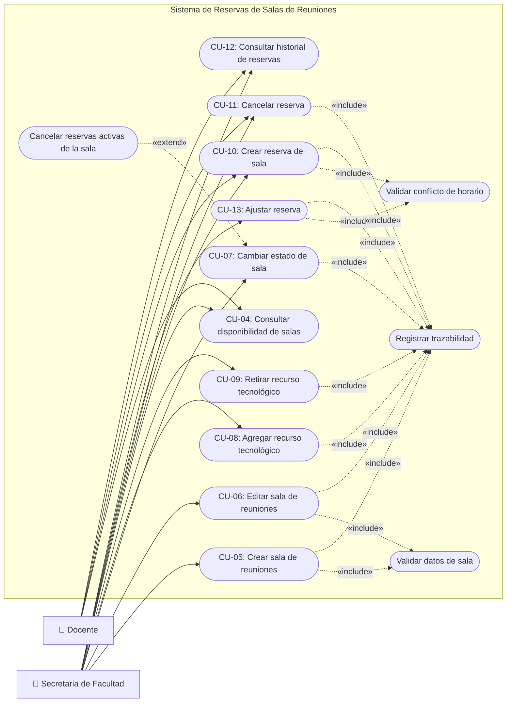

# Diagrama de Casos de Uso — Gestión de Salas y Reservas

## Actores

| Actor | Descripción |
|-------|-------------|
| **Docente** | Consulta disponibilidad, crea y cancela sus propias reservas, consulta su historial |
| **Secretaria de Facultad** | Todo lo del docente + CRUD de salas, ajustar reservas, ver historial completo de la facultad |

## Casos de Uso

### Gestión de Salas (solo Secretaria)
| ID | Caso de Uso | RF |
|----|-------------|-----|
| CU-05 | Crear sala de reuniones | RF-05 |
| CU-06 | Editar sala de reuniones | RF-06 |
| CU-07 | Cambiar estado de sala | RF-07 |
| CU-08 | Agregar recurso tecnológico | RF-08 |
| CU-09 | Retirar recurso tecnológico | RF-09 |

### Gestión de Reservas (Docente y Secretaria)
| ID | Caso de Uso | RF |
|----|-------------|-----|
| CU-04 | Consultar disponibilidad de salas | RF-04 |
| CU-10 | Crear reserva de sala | RF-10 |
| CU-11 | Cancelar reserva | RF-12 |
| CU-13 | Ajustar reserva (solo secretaria) | RF-13 |
| CU-12 | Consultar historial de reservas | RF-14, RF-15 |

### Casos de uso incluidos/extendidos
| ID | Caso de Uso | Tipo |
|----|-------------|------|
| CU-VAL | Validar datos de sala | «include» |
| CU-CONF | Validar conflicto de horario | «include» |
| CU-TRAZ | Registrar trazabilidad | «include» |
| CU-CANC | Cancelar reservas activas de la sala | «extend» |

## Relaciones include / extend

| Tipo | Desde | Hacia | Condición |
|------|-------|-------|-----------|
| `«include»` | CU-05, CU-06 | CU-VAL | Siempre se validan nombre único y capacidad |
| `«include»` | CU-10, CU-13 | CU-CONF | Siempre se valida conflicto de horario y franja 7AM–9:30PM |
| `«include»` | Todos los CU de mutación | CU-TRAZ | Toda acción se registra en log de auditoría (RF-16) |
| `«extend»` | CU-CANC | CU-07 | Solo al deshabilitar sala con reservas futuras confirmadas |

---

## Diagrama de Casos de Uso

---

## Descripción de Casos de Uso Incluidos y Extendidos

### CU-VAL: Validar datos de sala `«include»`

| Campo | Detalle |
|-------|---------|
| **Incluido por** | CU-05 (Crear sala), CU-06 (Editar sala) |
| **Descripción** | Valida los datos ingresados antes de guardar |
| **Validaciones** | 1. Nombre único dentro de la facultad |
| | 2. Capacidad entre 2 y 100 personas |
| | 3. Campos obligatorios completos |
| **Si falla** | Muestra mensaje de error, no se guarda |

### CU-CONF: Validar conflicto de horario `«include»`

| Campo | Detalle |
|-------|---------|
| **Incluido por** | CU-10 (Crear reserva), CU-13 (Ajustar reserva) |
| **Descripción** | Valida que no exista solapamiento con reservas existentes y que el horario esté dentro de la franja institucional |
| **Validaciones** | 1. No hay otra reserva CONFIRMADA para la misma sala con horario solapado (R-03) |
| | 2. hora_inicio ≥ 7:00 AM y hora_fin ≤ 9:30 PM (R-02) |
| | 3. hora_fin > hora_inicio |
| **Si falla** | Rechaza la reserva indicando el conflicto o la restricción violada |

### CU-TRAZ: Registrar trazabilidad `«include»`

| Campo | Detalle |
|-------|---------|
| **Incluido por** | CU-05, CU-06, CU-07, CU-08, CU-09, CU-10, CU-11, CU-13 |
| **RF** | RF-16 |
| **Descripción** | Registra automáticamente la acción en el log de auditoría |
| **Datos registrados** | Usuario, acción, entidad afectada, datos anteriores, datos nuevos, fecha y hora, dirección IP |

### CU-CANC: Cancelar reservas activas de la sala `«extend»`

| Campo | Detalle |
|-------|---------|
| **Extiende a** | CU-07 (Cambiar estado de sala) |
| **Condición** | Se activa cuando se **deshabilita** una sala que tiene reservas futuras CONFIRMADAS |
| **Flujo** | 1. Muestra las reservas afectadas a la secretaria |
| | 2. Solicita confirmación |
| | 3. Cancela las reservas (estado → CANCELADA, no se eliminan, R-06) |
| | 4. Notifica a los usuarios afectados |

---

## Notas de Diseño

- **Docente**: Solo accede a los CU de reservas (CU-04, CU-10, CU-11, CU-12). No ve ni accede al módulo de gestión de salas.
- **Secretaria**: Accede a **todos** los CU del diagrama. Es la única que puede gestionar salas (CU-05 a CU-09) y ajustar reservas de otros usuarios (CU-13).
- **CU-11 (Cancelar reserva)**: El docente solo puede cancelar sus propias reservas; la secretaria puede cancelar cualquier reserva de su facultad.
- **CU-12 (Consultar historial)**: El docente ve solo su historial propio (RF-14); la secretaria ve todas las reservas de la facultad (RF-15).
- **Funcionalidades ocultas por rol**: Las opciones que un rol no puede usar se ocultan de la interfaz — no se muestran mensajes de "acceso restringido".
